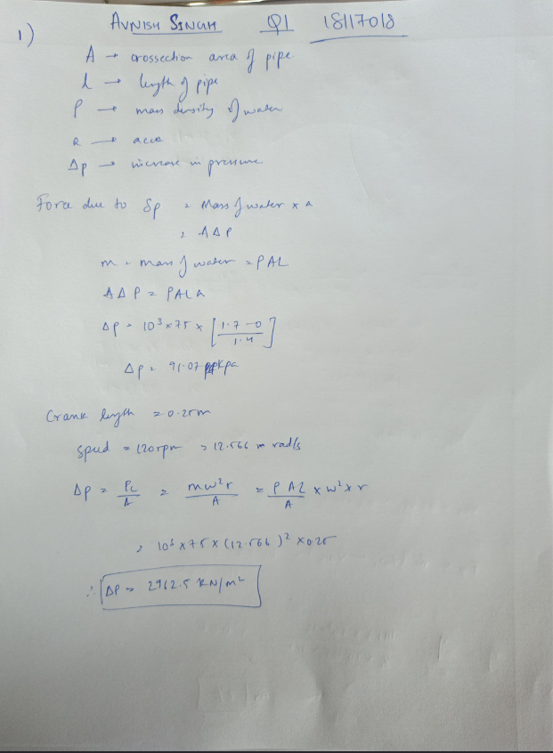
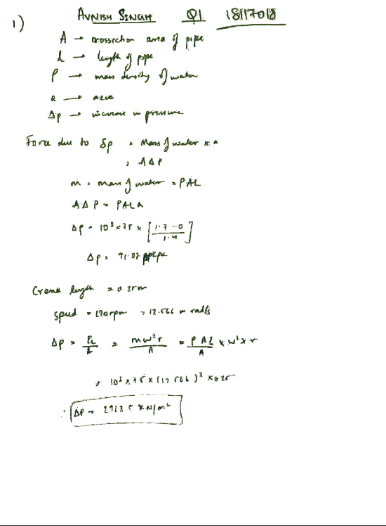

# Assignment-Copier

Converts images of handwritten assignments to black and white while increasing and distorting the font, hence reducing similarity with the original assignment and slightly blurring the text. Works good, even if there are diagrams since this isn't based off OCR.
Currently works for blue and black ink. Also dark blue ink gives better results with black ink detection.  
In case the output isn't good enough, try adjusting `check_black_ink` and `check_blue_ink` in `script.py` to your case.  
Requires python3

### How to use?

- `pip3 install -r requirements.txt`
- `mkdir before-pdf`
- Put all input PDFs into the above made directory
- `python3 script.py [-h] [-o [{blue,black}]]`
- Find converted PDFs in after-pdf

#### TODO

- Add support for direct image conversion

### Screenshots

Before:

After:
